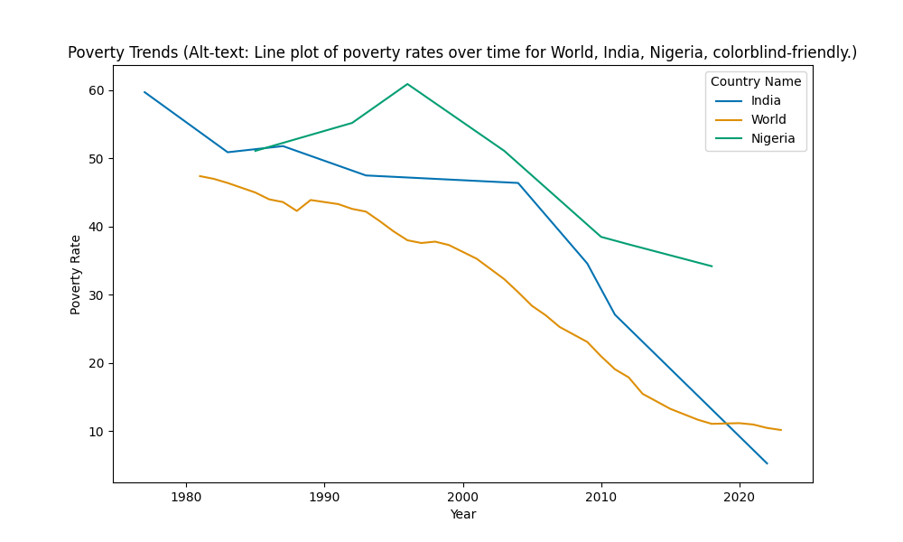
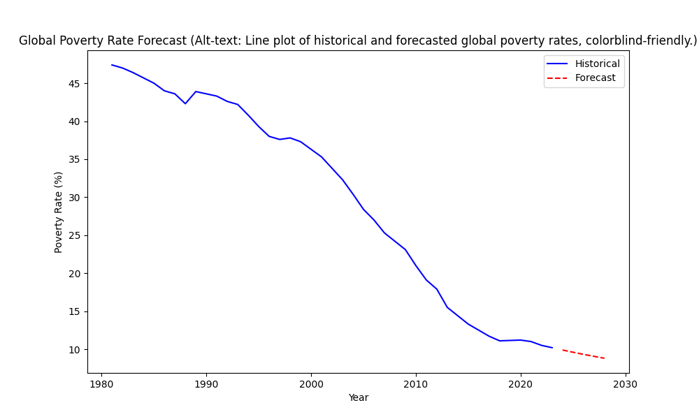

# Global Poverty Prediction and Inequality Mapping (SDG 1: No Poverty)

## Problem Statement
SDG 1 aims to end poverty in all its forms everywhere. This project analyzes global trends in extreme poverty rates using socioeconomic indicators to predict future reductions and highlight regional disparities.

## Data Source & Ethics Disclaimer
- Source: World Bank Poverty Headcount Ratio at $2.15 a day: https://data.worldbank.org/indicator/SI.POV.DDAY (Download as ZIP containing CSV)
- Ethics: Data is aggregated and public; potential biases include underrepresentation of low-income regions or informal economies. No personal data used. Limitations: Historical data may not capture recent events like crises. Ensure ethical use by addressing biases in analysis.

## Methods Used
- EDA: Pandas for cleaning, Matplotlib/Seaborn for visuals.
- Modeling: Time series forecasting (ARIMA with statsmodels), clustering (KMeans with scikit-learn), geospatial visualization (folium).
Plain-language: We clean the data, explore patterns, build models to predict or analyze outcomes, and visualize results for clarity.

## Key Findings
- Historical data shows declining poverty rates for World, India, and Nigeria from 1990 to 2020 (see results/poverty_trends.png).
- ARIMA forecast predicts continued decline in global poverty rates over the next 5 years (see results/poverty_forecast.png).
- Plain-language summary: This analysis shows poverty is decreasing globally, with predictions for further reductions, though data may miss informal economies.

## How to Reproduce
1. Clone repo: `git clone [https://github.com/ClarenceKaranja/SDG1-Global-Poverty-Prediction-and-Inequality-Mapping]`
2. Install deps: `pip install -r requirements.txt`
3. Download data: Follow links in data/data_sources.md (or run src/download_data.py if available)
4. Run notebook: `jupyter notebook notebooks/main.ipynb`
5. Optional: Run dashboard: `streamlit run src/app.py`

## Future Improvements
- Integrate real-time API data for updates.
- Add multilingual support in documentation.
- Explore extensions like incorporating user-contributed data via PRs.
- Enhance bias mitigation with advanced fairness libraries.
